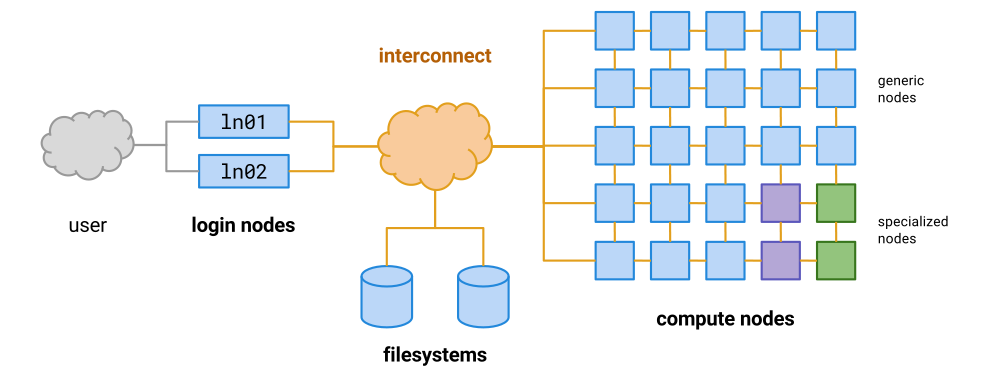

## Sherlock, a shared resource

Sherlock is a shared compute cluster available for use by all Stanford faculty
members and their research teams to support sponsored research.

!!! warning "Sherlock is a resource for research"

    **Sherlock is not suitable for course work, class assignments or general-use
    training sessions.**

    Users interested in using computing resources in such contexts are
    encouraged to investigate [FarmShare][url_farmshare], Stanford’s community
    computing environment, which is primarily intended for to support
    coursework.

It is open to the Stanford community as a computing resource to support
departmental or sponsored research, thus a faculty member's sponsorship is
required for all user accounts.

!!! danger "Usage policy"

    Please note that your use of this system falls under the "Computer and
    Network Usage Policy", as described in the [Stanford Administrative
    Guide][url_admin]. In particular, sharing authentication credentials is
    strictly prohibited.  Violation of this policy will result in termination
    of access to Sherlock.

Sherlock has been designed, deployed, and is maintained and operated by the
[Stanford Research Computing Center (SRCC)][url_srcc] staff. The SRCC is a
joint effort of the [Dean of Research][url_dor] and [IT Services][url_uit] to
build and support a comprehensive program to advance computational research at
Stanford.

Sherlock has been initially purchased and supported with seed funding from
Stanford's [Provost][url_provost]. It comprises a set of freely available
compute nodes, a few specific resources such as large-memory machines and GPU
servers, as well as the associated networking equipment and storage.  These
resources can be used to run computational codes and programs, and are managed
through a job scheduler using a [fair-share algorithm][url_fairshare].

### Data risk classification

!!! success "Low and Moderate Risk data"

    Sherlock is approved for computing with Low and Moderate Risk data only.

!!! danger "High Risk data"

    Sherlock is **NOT** [HIPAA][url_HIPAA] compliant and shouldn't be used to
    process [PHI][url_PHI] nor [PII][url_PII].  The system is approved for
    computing with Low and Moderate Risk data only, and is **not suitable to
    process High Risk data**.  For more information about data risk
    classifications, see the [Information Security Risk Classification
    page][url_risk].

## What's a cluster?

A computing cluster is a federation of multiple compute nodes (independent
computers), most commonly linked together through a high-performance
interconnect network.

What makes it a "super-computer" is the ability for a program to address
resources (such as memory, CPU cores) located in different compute nodes,
through the high-performance interconnect network.

On a computing cluster, users typically connect to [login nodes][g_login],
using a secure remote login protocol such as [SSH][g_ssh]. Unlike in
traditional interactive environments, users then need to prepare [compute
jobs][g_jobs] to submit to a [resource scheduler][g_scheduler]. Based on a set
of rules and limits, the scheduler will then try to match the jobs' resource
requirements with available resources such as [CPUs][g_cpu], memory or
computing accelerators such as [GPUs][g_gpu]. It will then execute the user
defined tasks on the selected resources, and generate output files in one of
the different [storage spaces][url_storage] available on the cluster, for the
user to review and analyze.

[g_cpu]:        glossary#cpu
[g_gpu]:        glossary#gpu
[g_login]:      glossary#login-nodes
[g_ssh]:        glossary#ssh
[g_jobs]:       glossary#job
[g_scheduler]:  glossary#scheduler
[url_storage]:  /docs/storage/

## The condominium model

For users who need more than casual access to a shared computing environment,
SRCC also offers faculty members the possibility to purchase additional
dedicated resources to augment Sherlock, by becoming Sherlock *owners*.
Choosing from a standard set of server configurations supported by SRCC
staff (known as the Sherlock *catalog*), principal investigators (PIs) can
purchase their own servers to add to the cluster.

The vast majority of Sherlock's compute nodes are actually owners nodes, and PI
purchases are the main driver behind the rapid expansion of the cluster, which
went from 120 nodes in early 2014, to more than 1,000 nodes mid-2017. An order
of magnitude increase in about 3 years.

This model, often referred to as the **Condo model**, allows Sherlock owners to
benefit from the scale of the cluster and give them access to more compute
nodes than their individual purchase.  This provides owners with much greater
flexibility than owning a standalone cluster.

The resource scheduler configuration works like this:

* owners and their research teams have priority use of the resources they
  purchase,
* when those resources are idle, other owners can use them,
* when the purchasing owner wants to use his/her resources, other jobs will be
  killed

This provides a way to get more resources to run less important jobs in the
background, while making sure that an owner always gets immediate access to
his/her own nodes.

Participating owners also have shared access to the original base Sherlock
nodes, along with everyone else.

### Benefits

Benefits to owners include:

* Data center hosting, including backup power and cooling,
* Access to high-performance, large parallel scratch disk space,
* Priority access to nodes that they own,
* Background access to any owner nodes that are not in use,
* System configuration and administration,
* User support,
* Standard software stack, appropriate for a range of research needs,
* Possibility for users to install additional software applications as needed,

### How to become an owner

For administrative reasons, SRCC offers PIs the possibility to purchase
Sherlock nodes on a quarterly basis. Large orders could be accommodated at any
time, though.

!!! warning "Minimum purchase"

    Please note that the minimum purchase per PI is one physical server. We
	cannot accommodate multiple PIs pooling funds for a single node.

If you are interested in becoming an owner, you can find the latest information
about ordering Sherlock nodes on the [Sherlock ordering page][url_orders]
(SUNet ID login required). Feel free to [contact us][email] is you have any
additional question.

## Cluster generations

The research computing landscape evolves very quickly, and to both accommodate
growth and technological advances, it's necessary to adapt the Sherlock
environment to these evolutions.

Every year or so, a new generation of processors is released, which is why,
over a span of several years, multiple generations of CPUs and GPUs make their
way into Sherlock. This provides users with access to the latest features and
performance enhancements, but it also adds some heterogeneity to the cluster,
which is important to keep in mind when compiling software and requesting
resources to run them.

Another key component of Sherlock is the interconnect network that links all of
Sherlock's compute nodes together and act as a backbone for the whole cluster.
This network fabric is of finite capacity, and based on the individual
networking switches characteristics and the typical research computing
workflows, it can accommodate up to about 850 compute nodes.

As nodes get added to Sherlock, the number of available ports decreases, and at
some point, the fabric gets full and no more nodes can be added. Sherlock
reached that stage in late 2016, which prompted the installation of a whole new
fabric, to continue adding nodes to the cluster.

This kind of evolution is the perfect opportunity to upgrade other components
too: management software, ancillary services architecture and
user applications were completely overhauled and a new, completely separate
cluster was kick-started. Sherlock 2.0 is a complete refresh of Sherlock, using
a different set of hardware and software, while conserving the same storage
infrastructure, to ease the transition process.

!!! tip "Transition to Sherlock 2.0"

    For users who are already familiar with Sherlock, a [transition
    guide][url_transition] lists all the differences and the important
    information for starting on Sherlock 2.0.

After a transition period, the older Sherlock hardware, compute and login
nodes, will be merged in the new cluster, and from a logical perspective
(connection, job scheduling and computing resources), both will form a single
cluster again.

As Sherlock continues to evolve and grow, the new fabric will certainly get
full again, and the same process will happen again to start the next generation
of Sherlock.

## Maintenances and upgrades

The SRCC institutes a monthly scheduled maintenance window on Sherlock, to
ensure optimal operation, avoid potential issues and prepare for future
expansions.  This window will be used to make hardware repairs, software and
firmware updates, and perform general manufacturer recommended maintenance on
our environment.

!!! info "Maintenance schedule"

     As often as possible, maintenances will take place on the **first Tuesday
     of every month, from 8am to 12am**, and will be announced 2 weeks in
     advance, through the usual communication channels.

In case an exceptional amount of work is required, the maintenance window could
be extended to 10 hours (from 8am to 6pm).

During these times, access to Sherlock will be unavailable, login will be
disabled and jobs won't run. A reservation will be placed in the scheduler so
running jobs can finish before the maintenance, and jobs that wouldn't finish
by the maintenance window would be pushed after it.

### Common questions

??? question "Why doing maintenances at all?"

    Due to growth in our compute environment and the increasing complexity of
    the systems we deploy, we felt it prudent to arrange for a regular time
    when we could comfortably and without pressure fix problems or update
    facilities with minimal impact to our customers. Most, if not all, major
    HPC centers have regular maintenance schedules.  We also need to enforce
    the [Minimum Security][url_minsec] rules edicted by the Stanford
    Information Security Office, which mandate deployment of security patches
    in a timely manner.

??? question "Why Tuesdays 8am-12am? Why not do this late at night?"

    We have observed that the least busy time for our services is at the
    beginning of the week in the morning hours. Using this time period should
    not interrupt most of our users. If the remote possibility of a problem
    that extends past the scheduled downtime occurs, we would have our full
    staff fresh and available to assist in repairs and quickly restore service.

??? question "I have jobs running, what will happen to them?"

    For long-running jobs, we strongly recommend checkpointing your results on
    a periodic basis. Besides, we will place a reservation in the scheduler for
    each maintenance that would prevent jobs to run past it. This means that
    the scheduler will only allow jobs to run if they can finish by the time
    the maintenance starts. If you submit a long job soon before the
    maintenance, it will be delayed until after the maintenance. That will
    ensure that no work is lost when the maintence starts.

[comment]: #  (link URLs -----------------------------------------------------)
[email]:          mailto:srcc-support@stanford.edu
[url_provost]: 	  https://provost.stanford.edu/
[url_dor]:     	  https://doresearch.stanford.edu/research-offices/dor-office-vice-provost-and-dean-research
[url_uit]:	   	  https://uit.stanford.edu
[url_srcc]:    	  https://srcc.stanford.edu/
[url_orders]:	  https://srcc.stanford.edu/private/sherlock-qtr-order
[url_risk]:  	  https://uit.stanford.edu/guide/riskclassifications
[url_minsec]:     https://uit.stanford.edu/guide/securitystandards
[url_admin]:  	  https://adminguide.stanford.edu
[url_fairshare]:  /docs/advanced-topics/scheduler#fair-share
[url_transition]: /docs/overview/transition
[url_farmshare]:  https://uit.stanford.edu/service/sharedcomputing

[url_HIPAA]: https://en.wikipedia.org/wiki/Health_Insurance_Portability_and_Accountability_Act
[url_PHI]:   https://en.wikipedia.org/wiki/Protected_health_information
[url_PII]:   https://en.wikipedia.org/wiki/Personally_identifiable_information
