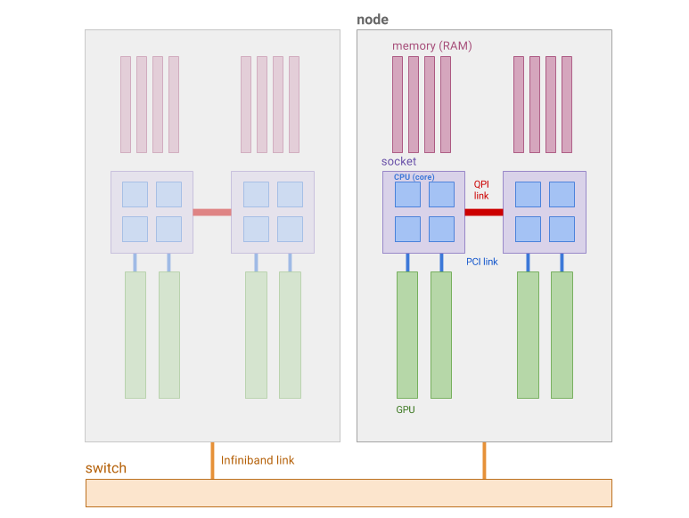

## Cluster components

The terms that are typically used to describe cluster components could be
confusing, so in an effort to clarify things, here's a schema of the most
important ones, and their definition.

##### CPU

: A Central Processing Unit (CPU), or core, or CPU core, is the smallest unit
in a microprocessor that can carry out computational tasks, that is, run
programs. Modern processors typically have multiple cores.

##### Socket

: A socket is the connector that houses the microprocessor. By extension, it
represents the physical package of a processor, that typically contains
multiple cores.

##### Node

: A node is a physical, stand-alone computer, that can handle computing tasks
and run jobs. It's connected to other compute nodes via a fast network
interconnect, and contains CPUs, memory and devices managed by an operating
system.

##### Cluster

: A cluster is the complete collection of nodes with networking and file
storage facilities. It's usually a group of independent computers connected via
a fast network interconnect, managed by a resource manager, which acts as a
large parallel computer.

## Other commonly used terms

To make this documentation more accessible, we try to explain key terms in a
non-technical way. When reading these pages, please keep in mind the following
definitions, presented in alphabetical order:

##### Application

: An application is a computer program designed to perform a group of
coordinated functions, tasks, or activities for the benefit of the user. In the
context of scientific computing, an application typically performs computations
related to a scientific goal (molecular dynamics simulations, genome assembly,
compuational fluid dynamics simulations, etc).

##### Backfill

: Backfill scheduling is a method that a scheduler can use in order to maximize
utilization. It allows smaller (both in terms of size and time requirements),
lower priority jobs to start before larger, higher priority ones, as long as
doing so doesn't push back the higher-priority jobs expected start time.

##### Executable

: A binary (or executable) program refers to the machine-code compiled version
of an application. This is  which is a binary file that a computer can execute
directly. As opposed to the application source code, which is the
human-readable version of the application internal instructions, and which
needs to be compiled by a compiler to produce the executable binary.

##### Fairshare

: A resource scheduler ranks jobs by priority for execution. Each job's
priority in queue is determined by multiple factors, among which
one being the user's fairshare score.  A user's fairshare score is computed
based on a target (the given portion of the resources that this user should be
able to use) and the user's effetive usage, *ie* the amount of resources (s)he
effectively used in the past.  As a result, the more resources past jobs have
used, the lower the priority of the next jobs will be.  Past usage is computed
based on a sliding window and progressively forgotten over time.  This enables
all users on a shared resource to get a fair portion of it for their own use,
by giving higher priorty to users who have been underserved in the past.

##### FLOPS

: Floating-point Operations Per Second (FLOPS) are a measure of computing
performance, and represent the number of floating-point operations that a CPU
can perform each second. Modern CPUs and GPUs are capable of doing TeraFLOPS
(10^12 floating-point operations per second), depending on the precision of
those operations (half-precision: 16 bits, single-precision: 32 bits,
double-precision: 64 bits).

##### GPU

: A Graphical Processing Unit (GPU) is a specialized device initially designed
to generate graphical output.  On modern computing architecture, they are used
to accelerate certain types of computation, which they are much faster than
CPUs at. GPUs have their own memory, and are attached to CPUs, within a node.
Each compute node can host one or more GPUs.

##### HPC

: High Performance Computing (HPC) refers to the practice of aggregating
computing power to achieve higher performance that would be possible by using a
typical computer.

##### Infiniband

: Infiniband is a networking standard that features high bandwidth and low
latency. The current Infiniband devices are capable of transferring data at up
to 100 Gbits/sec with less than a microsecond latency. As of this writing, the
popular Infiniband versions are FDR (Fourteen Data Rate) with 56 Gbits/sec and
EDR (Enhanced Data Rate) with 100 Gbits/sec.

##### IOPS

: Input/output operations per second (IOPS, pronounced eye-ops) is an
input/output performance measurement used to characterize computer storage
system performance.

##### Job

: A job, or batch job, is the scheduler’s base unit of computing by which
resources are allocated to a user for a specified amount of time. Users create
job submission scripts to ask the scheduler for resources such as cores,
memory, runtime, etc. The scheduler puts the requests in a queue and allocates
requested resources based on jobs’ priority.

##### Job step

: Job steps are sets of (possibly parallel) tasks within a job

##### Login nodes

: Login nodes are points of access to a compute cluster. Users usually connect
to login nodes via SSH to compile and debug their code, review their results,
do some simple tests, and submit their batch jobs to the parallel computer.

    !!! Danger "Login nodes are not for computing"
        Login nodes are usually shared among many users and therefore must not
        be used to run computationally intensive tasks. Those should be
        submitted to the scheduler which will dispatch them on compute nodes.

##### Modules

: Environment modules, or software modules, are a type of software management
tool used on in most HPC environments. Using modules enable users to
selectively pick the software that they want to use and add them to their
environment. This allows to switch between different versions or flavors of the
same software, pick compilers, libraries and software components and avoid
conflicts between them.

##### MPI

: Message Passing Interface (MPI) is a standardized and portable
message-passing system designed to exchange information between processes
running on different nodes. There are several implementations of the MPI
standard, which is the most common way used to scale parallel applications
beyond a single compute node.

##### OpenMP

: Open Multi Processing (OpenMP) is a parallel programming model
designed for shared memory architecture. It's based on pragmas that can be
added in applications to let the compiler generate a code that
can run on multiple cores, within the same node.

##### Partition

: A partition is a set of compute nodes within a cluster with a
common feature. For example, compute nodes with GPU, or compute nodes belonging
to same owner,  could form a partition.

##### QOS

: A Quality Of Service (QOS) is the set of rules and limitations that apply to
a categories of job. The combination of a partition (set of machines where a
job can run) and QOS (set of rules that applies to that job) makes what is
often referred to as a scheduler *queue*.

##### Run time

: The run time, or walltime, of a job is the time required to finish its
execution.

##### Scheduler

: The goal of a job scheduler is to find the appropriate resources to run a set
of computational tasks in the most efficient manner. Based on resource
requirements and job descriptions, it will prioritize those jobs, allocate
resources (nodes, CPUs, memory) and schedule their execution.

##### Slurm

: Simple Linux Utility for Resource Management (SLURM) is a software that
manages computing resources and schedule tasks on them. Slurm coordinates
running of many programs on a shared facility and makes sure that resources are
used in an optimal manner.

##### SSH

: Secure Shell (SSH) is a protocol to securely access remote computers.
Based on the client-server model, multiple users with an SSH client can access
a remote computer. Some operating systems such as Linux and Mac OS have a
built-in SSH client and others can use one of many publicly available clients.

##### Thread

: A process, in the simplest terms, is an executing program. One or more
threads run in the context of the process. A thread is the basic unit to which
the operating system allocates processor time. A thread can execute any part of
the process code, including parts currently being executed by another thread.
Threads are co-located on the same node.

##### Task

: In the Slurm context, a task is to be understood as a process. A
multi-process program is made of several tasks. A task is typically used to
schedule a MPI process, that in turn can use several CPUs.  By contrast, a
multi-threaded program is composed of only one task, which uses several CPUs.

