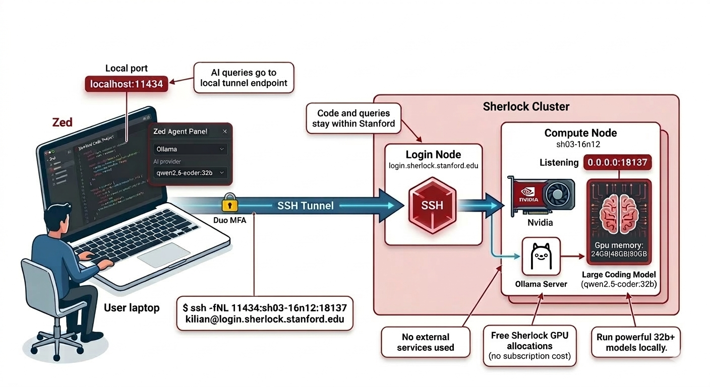

# Zed with Ollama on Sherlock

[Zed][url_zed] is a high-performance, open-source code editor designed for
speed and built-in AI assistance. It can be used as a local IDE while
using [Ollama][url_ollama] running on a Sherlock GPU node for AI features,
keeping your code private, running open-source models, and eliminating
subscription costs.


## Zed + Ollama

Most AI coding tools require a paid subscription and send your code to external
cloud services. Zed + Ollama on Sherlock does neither:

| Tool | Subscription required | Code stays within Stanford? |
|---|---|---|
| GitHub Copilot | :fontawesome-solid-check:{: .chk_yes :} | :fontawesome-solid-xmark:{: .chk_no :} |
| Cursor | :fontawesome-solid-check:{: .chk_yes :} | :fontawesome-solid-xmark:{: .chk_no :} |
| **Zed + Ollama on Sherlock** | :fontawesome-solid-xmark:{: .chk_no :} | :fontawesome-solid-check:{: .chk_yes :} |

Your code and queries travel to Sherlock over SSH and never reach external
services. Sherlock GPU allocations are free, so there's no subscription cost.
The GPUs on Sherlock can run large open-source coding models (32B+) that would
be expensive to access through commercial AI services, and you have full
control over which model to use. Zed itself is written in Rust and
GPU-accelerated, making it one of the faster editors available.

The setup takes three steps, done once per session:

1. Submit a Slurm job that starts an Ollama server on a GPU node
2. Open an SSH tunnel from your local machine to that node
3. Configure Zed to use the tunnel as its Ollama endpoint

After that, Zed's AI features work as if Ollama were running locally.



!!! info "Zed is available on macOS, Linux and Windows"

    See the [Zed download page][url_zed_download] for installation instructions
    on your platform.


## Prerequisites

* [Install Zed][url_zed_download] on your local machine
* A [Sherlock account][url_account]

### Starting Ollama on Sherlock

Submit a batch job to start an Ollama server on a GPU node. The script below
picks a random available port and writes the connection details to a dedicated
file:

``` bash { title="ollama_server.sh" .copy .select }
#!/bin/bash
#SBATCH --job-name      ollama-server
#SBATCH --output        ollama-server-%j.out
#SBATCH --partition     gpu
#SBATCH --gpus          1
#SBATCH --constraint    "[GPU_MEM:24GB|GPU_MEM:48GB|GPU_MEM:80GB]"
#SBATCH --cpus-per-task 4
#SBATCH --time          08:00:00

ml ollama

# pick a random available port
OLLAMA_PORT=$(( RANDOM % 60000 + 1024 ))
while (echo > /dev/tcp/localhost/$OLLAMA_PORT) &>/dev/null; do
    OLLAMA_PORT=$(( RANDOM % 60000 + 1024 ))
done

# write tunnel info to a dedicated file for easy retrieval
cat > ollama-server-${SLURM_JOB_ID}.tunnel << EOF
================================================================
  Ollama server: $SLURM_NODELIST:$OLLAMA_PORT
  SSH tunnel:    ssh -fNL 11434:$SLURM_NODELIST:$OLLAMA_PORT \\
                     $USER@login.sherlock.stanford.edu
================================================================
EOF

OLLAMA_HOST=0.0.0.0:$OLLAMA_PORT ollama serve
```

Submit the job:

``` none { .copy .select }
$ sbatch ollama_server.sh
Submitted batch job 6515470
```

Once the job has started, retrieve the connection details from the tunnel file:

``` none
$ cat ollama-server-6515470.tunnel
================================================================
  Ollama server: sh03-16n12:18137
  SSH tunnel:    ssh -fNL 11434:sh03-16n12:18137 \
                     kilian@login.sherlock.stanford.edu
================================================================
```

!!! tip "Choosing a model"

    For coding assistance, we recommend models from the
    [`qwen2.5-coder`][url_ollama_qwen_coder] or
    [`codellama`][url_ollama_codellama] families. Larger models (32B+) give
    better results but require more GPU memory. For a faster, lighter option,
    `qwen2.5-coder:7b` works well on 24GB GPUs.

    See the [Ollama page][url_ollama_page] for instructions on pulling and
    managing models.


### Setting up the SSH tunnel

The Ollama server runs on a compute node that is not directly reachable from
outside Sherlock. An SSH tunnel forwards a local port on your machine through
the login node to the compute node.

Copy the tunnel command from the job output and run it on your local machine:

``` shell { .copy .select }
$ ssh -fNL 11434:<node>:<port> <sunetid>@login.sherlock.stanford.edu
```

For example, with the output above:

``` none
$ ssh -fNL 11434:sh03-16n12:18137 kilian@login.sherlock.stanford.edu
```

The `-fN` flags put the tunnel in the background without opening a shell.
You will be prompted for your password and Duo second factor as usual.

Verify the tunnel is working by querying the Ollama API from your local
machine:

``` none
$ curl http://localhost:11434/api/tags
{"models":[...]}
```

!!! tip "Avoiding repeated Duo prompts"

    If you open multiple tunnels or sessions during a work session, you can
    avoid authenticating each time by enabling SSH connection multiplexing.
    See the [Advanced connection options][url_avoid_duo] page for details.

!!! warning "The tunnel must be restarted when the job restarts"

    When your Ollama job ends (or is resubmitted), the compute node and port
    will change. Kill the old tunnel (`pkill -f "ssh -fNL 11434"`) and start a
    new one with the updated connection details from the new job output.


## Configuring Zed

### Selecting Ollama as the AI provider

Open the Zed agent panel via **View › Agent Panel**. Click the model selector
at the top of the panel, choose **Ollama**, and select the model you loaded on
Sherlock.

Since the tunnel forwards to the default Ollama port (`11434`), Zed connects
to it automatically without any URL configuration.


Alternatively, open `settings.json` (++cmd+alt+comma++ on macOS,
++ctrl+alt+comma++ on Linux) and add:

``` json { .copy .select }
{
  "assistant": {
    "version": "2",
    "default_model": {
      "provider": "ollama",
      "model": "qwen2.5-coder:32b"
    }
  }
}
```

Replace `qwen2.5-coder:32b` with whichever model you have loaded on Sherlock.

### Edit predictions

Zed's inline edit predictions can also be backed by Ollama. In `settings.json`,
add:

``` json { .copy .select }
{
  "edit_predictions": {
    "mode": "eager"
  },
  "language_model": {
    "provider": "ollama"
  }
}
```

For inline completions, a smaller, faster model (e.g. `qwen2.5-coder:7b`)
works better than a large one, since latency matters more than raw quality for
character-by-character suggestions.


## Usage

With the tunnel up and Zed configured:

* the agent panel (**View › Agent Panel**) lets you chat with the model, ask
  questions about your code, or request explanations and refactors
* inline assistance (++ctrl+enter++) transforms selected code in place
* edit predictions suggest completions as you type, accepted with ++tab++


None of your prompts, code, or completions leave Stanford's infrastructure.


### Remote Development

Zed's [Remote Development][url_zed_remote] feature lets you open a project on a
Sherlock login node directly: Zed still runs on your local machine, but reads
and writes files on Sherlock over SSH. The AI assistant also runs locally, so
it reaches Ollama through the same SSH tunnel set up in
[Prerequisites](#prerequisites), with no additional configuration.

Set up the Ollama job and SSH tunnel as described above. Then open a remote
project in Zed (**File › Open Remote Project**), enter
`login.sherlock.stanford.edu`, and open your project directory on Sherlock.
Zed installs its server component on the login node on the first connection.


## Troubleshooting

If Zed cannot reach the Ollama server, check the server logs in the job output
file:

``` none { .copy .select }
$ cat ollama-server-<jobid>.out
```

Or follow them in real time while the job is running:

``` none { .copy .select }
$ tail -f ollama-server-<jobid>.out
```

Common things to look for:

* **Model not loaded**: the server starts but no model is pulled yet. Load one
  with `OLLAMA_HOST=<node>:<port> ollama pull qwen2.5-coder:7b` from an
  interactive session on Sherlock.
* **Port conflict**: the port-selection loop in the script handles this, but if
  the job output shows a bind error, cancel and resubmit the job.
* **Tunnel not running**: verify with `curl http://localhost:11434/api/tags` -- a
  connection error means the tunnel is down or has been interrupted.
* **Job ended**: check with `squeue -u $USER` that the job is still running.
  If it has ended, resubmit and restart the tunnel.


[comment]: #  (link URLs -----------------------------------------------------)

[url_zed]:                  //zed.dev
[url_zed_download]:         //zed.dev/download
[url_zed_remote]:           //zed.dev/docs/remote-development
[url_ollama_qwen_coder]:    //ollama.com/library/qwen2.5-coder
[url_ollama_codellama]:     //ollama.com/library/codellama

[url_account]:              ../../getting-started/index.md#how-to-request-an-account
[url_avoid_duo]:            ../../advanced-topics/connection.md#avoiding-multiple-duo-prompts
[url_ollama_page]:          ollama.md
[url_ollama]:               //ollama.com


--8<--- "includes/_acronyms.md"
