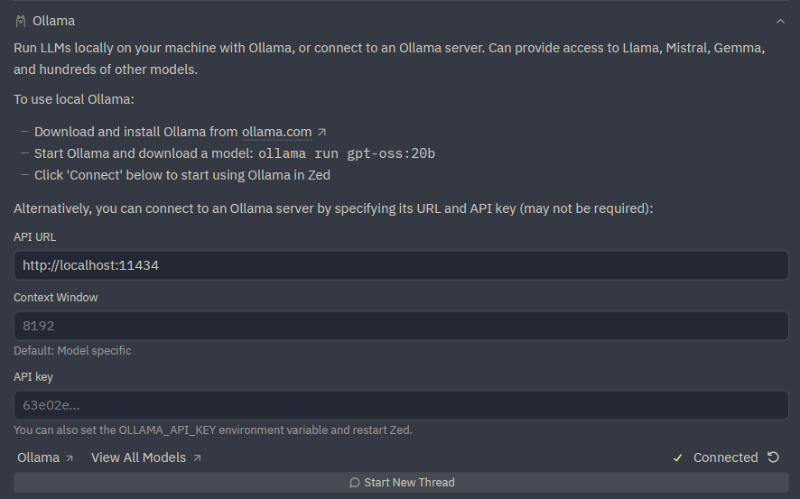
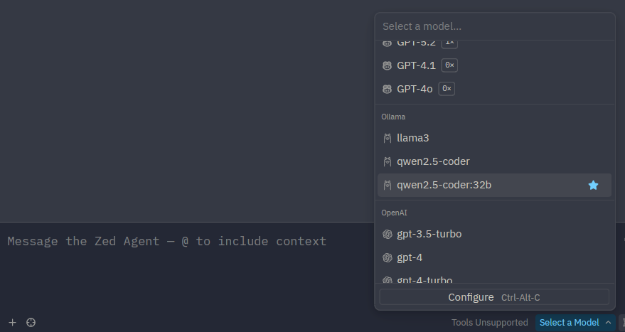
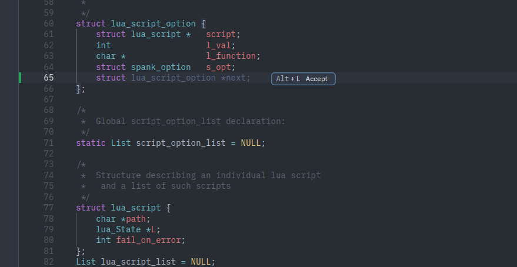
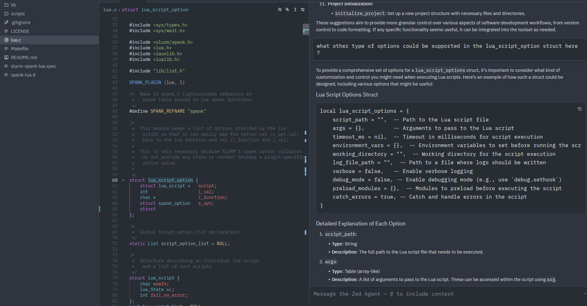

# Remote development on Sherlock

[Zed][url_zed] is a high-performance, open-source code editor that supports
working on remote projects over SSH: Zed runs on your local machine while
reading and writing files directly on Sherlock. Pair it with an
[Ollama][url_ollama] server on a Sherlock GPU node and you also get
AI-assisted coding without any code or prompts leaving Stanford.

!!! info "Zed is available on macOS, Linux and Windows"

    See the [Zed download page][url_zed_download] for installation
    instructions on your platform.


## Remote project access

Zed's [Remote Development][url_zed_remote] feature connects to a Sherlock
login node over SSH. Open a remote project via **File › Open Remote Project**,
enter `login.sherlock.stanford.edu`, and select your project directory.
Zed installs its server component on the login node on the first connection.

From that point, files open, save, and search on Sherlock as if they were
local, and you can open a terminal in Zed that runs directly on the login
node.


## AI features with Ollama

Adding an Ollama server gives Zed's AI assistant a local model to talk to.
Your code and queries travel to Sherlock over SSH and never reach external
services. Sherlock GPU allocations are free, and large open-source coding
models (32B+) are available at no subscription cost.

| Tool | Subscription required | Code stays within Stanford? |
|---|---|---|
| GitHub Copilot | :fontawesome-solid-check:{: .chk_yes :} | :fontawesome-solid-xmark:{: .chk_no :} |
| Cursor | :fontawesome-solid-check:{: .chk_yes :} | :fontawesome-solid-xmark:{: .chk_no :} |
| **Zed + Ollama on Sherlock** | :fontawesome-solid-xmark:{: .chk_no :} | :fontawesome-solid-check:{: .chk_yes :} |

The setup for AI features takes three steps, done once per session:

1. Submit a Slurm job that starts an Ollama server on a GPU node
2. Open an SSH tunnel from your local machine to that node
3. Configure Zed to use the tunnel as its Ollama endpoint

After that, Zed's AI features work as if Ollama were running locally.


### Prerequisites

* [Install Zed][url_zed_download] on your local machine
* A [Sherlock account][url_account]

#### Starting Ollama on Sherlock

Use the [Ollama server job script][url_ollama_job] to start an Ollama server
on a GPU node. Once the job is running, retrieve the endpoint from your local
machine:

``` shell { .copy .select }
$ ssh <sunetid>@login.sherlock.stanford.edu cat ~/.ollama_server
sh03-16n12:18137
```

!!! tip "Choosing a model"

    For coding assistance, we recommend models from the
    [`qwen2.5-coder`][url_ollama_qwen_coder] or
    [`codellama`][url_ollama_codellama] families. Larger models (32B+) give
    better results but require more GPU memory. For a faster, lighter option,
    `qwen2.5-coder:7b` works well on 24GB GPUs.

    See the [Ollama page][url_ollama_page] for instructions on pulling and
    managing models.


#### Setting up the SSH tunnel

The Ollama server runs on a compute node that is not directly reachable from
outside Sherlock. An SSH tunnel forwards a local port on your machine through
the login node to the compute node.

Use the endpoint from `~/.ollama_server` to open the tunnel from your local
machine:

``` shell { .copy .select }
$ ssh -fNL 11434:<node>:<port> <sunetid>@login.sherlock.stanford.edu
```

For example, with the output above:

``` shell
$ ssh -fNL 11434:sh03-16n12:18137 kilian@login.sherlock.stanford.edu
```

The `-fN` flags put the tunnel in the background without opening a shell.
You will be prompted for your password and Duo second factor as usual.

Verify the tunnel is working by querying the Ollama API from your local
machine:

``` shell
$ curl http://localhost:11434/api/tags
{"models":[...]}
```

!!! tip "Avoiding repeated Duo prompts"

    If you open multiple tunnels or sessions during a work session, you can
    avoid authenticating each time by enabling SSH connection multiplexing.
    See the [Advanced connection options][url_avoid_duo] page for details.

!!! warning "The tunnel must be restarted when the job restarts"

    When your Ollama job ends (or is resubmitted), the compute node and port
    will change. Kill the old tunnel (`pkill -f "ssh -fNL 11434"`) and start a
    new one with the updated connection details from the new job output.


### Configuring Zed

#### Selecting Ollama as the AI provider

Open the Zed agent panel via **View › Agent Panel**. Click the model selector
at the top of the panel, choose **Ollama**, and select the model you loaded on
Sherlock.

Since the tunnel forwards to the default Ollama port (`11434`), Zed connects
to it automatically without any URL configuration.




Alternatively, open `settings.json` (++cmd+alt+comma++ on macOS,
++ctrl+alt+comma++ on Linux) and add:

``` json { .copy .select }
{
  "assistant": {
    "version": "2",
    "default_model": {
      "provider": "ollama",
      "model": "qwen2.5-coder:32b"
    }
  }
}
```

Replace `qwen2.5-coder:32b` with whichever model you have loaded on Sherlock.

#### Edit predictions

Zed's inline edit predictions can also be backed by Ollama. In `settings.json`,
add:

``` json { .copy .select }
{
  "edit_predictions": {
    "mode": "eager"
  },
  "language_model": {
    "provider": "ollama"
  }
}
```

For inline completions, a smaller, faster model (e.g. `qwen2.5-coder:7b`)
works better than a large one, since latency matters more than raw quality for
character-by-character suggestions.




### Usage

With the tunnel up and Zed configured:

* the agent panel (**View › Agent Panel**) lets you chat with the model, ask
  questions about your code, or request explanations and refactors
* inline assistance (++ctrl+enter++) transforms selected code in place
* edit predictions suggest completions as you type, accepted with ++tab++



None of your prompts, code, or completions leave Stanford's infrastructure.


### Troubleshooting

If Zed cannot reach the Ollama server, check the server logs in the job output
file:

``` none { .copy .select }
$ cat ollama_server-<jobid>.out
```

Or follow them in real time while the job is running:

``` none { .copy .select }
$ tail -f ollama_server-<jobid>.out
```

Common things to look for:

* **Model not loaded**: the server starts but no model is pulled yet. Load one
  with `OLLAMA_HOST=<node>:<port> ollama pull qwen2.5-coder:7b` from an
  interactive session on Sherlock.
* **Port conflict**: the port-selection loop in the script handles this, but if
  the job output shows a bind error, cancel and resubmit the job.
* **Tunnel not running**: verify with `curl http://localhost:11434/api/tags` (a
  connection error means the tunnel is down or has been interrupted).
* **Job ended**: check with `squeue -u $USER` that the job is still running.
  If it has ended, resubmit and restart the tunnel.


[comment]: #  (link URLs -----------------------------------------------------)

[url_zed]:                  //zed.dev
[url_zed_download]:         //zed.dev/download
[url_zed_remote]:           //zed.dev/docs/remote-development
[url_ollama_qwen_coder]:    //ollama.com/library/qwen2.5-coder
[url_ollama_codellama]:     //ollama.com/library/codellama

[url_account]:              ../../getting-started/index.md#how-to-request-an-account
[url_avoid_duo]:            ../../advanced-topics/connection.md#avoiding-multiple-duo-prompts
[url_ollama_page]:          ../using/ollama.md
[url_ollama_job]:           ../using/ollama.md#running-ollama-server-in-a-job
[url_ollama]:               //ollama.com


--8<--- "includes/_acronyms.md"
