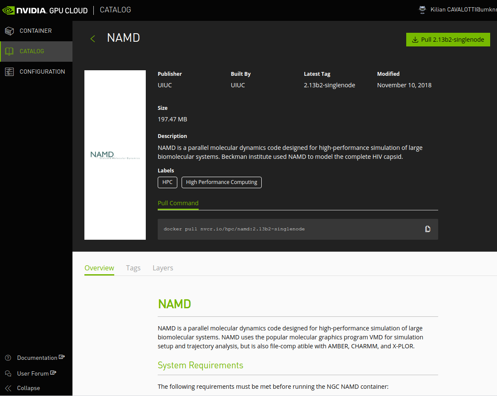

[Singularity][url_singularity] is a tool for running
[containers][url_containers] on HPC systems, similar to [Docker][url_docker].

## Introduction

Containers are a solution to the problem of how to get software to run reliably
when moved from one computing environment to another. They also resolve
installation problems by packaging all the dependencies of an application
within a self-sustainable image, _a.k.a_ a container.

!!! info "What's a container?"

    Put simply, a container consists of an entire runtime environment: an
    application, plus all its dependencies, libraries and other binaries, and
    configuration files needed to run it, bundled into one package. By
    containerizing the application platform and its dependencies, differences
    in OS distributions and underlying infrastructure are abstracted away.


### Why not Docker?

Docker has long been the reference and the most popular container framework in
DevOps and Enterprise IT environments, so why not use Docker on Sherlock? Well,
for a variety of technical reasons, mostly related to security.

Docker has never been designed nor developed to run in multi-tenants
environments, and even less on HPC clusters. Specifically:

  * Docker requires a daemon running as `root` on all of the compute nodes,
    which has serious security implications,
  * all authenticated actions (such as `login`, `push` ...) are also executed
    as `root`, meaning that multiple users can't use those functions on the
    same node,
  * Docker uses cgroups to isolate containers, as does the Slurm scheduler,
    which uses cgroups to allocate resources to jobs and enforce limits. Those
    uses are unfortunately conflicting.
  * but most importantly, *allowing users to run Docker containers will give
    them* `root` *privileges* inside that container, which will in turn let them
    access any of the clusters' filesystems as `root`. This opens the door to
    user impersonation, inappropriate file tampering or stealing, and is
    obviously not something that can be allowed on a shared resource.

That last point is certainly the single most important reason why we won't use
Docker on Sherlock.

### Why Singularity?

!!! tldr "Singularity is Docker for HPC systems"

    Singularity allows [running Docker containers
    natively][url_singularity_docker], and is a perfect replacement for Docker
    on HPC systems such as Sherlock. That means that existing Docker container
    can be directly imported and natively run with SIngularity.

Despite Docker's shortcomings on HPC systems, the appeal of containers for
scientific computing is undeniable, which is why we provide
[Singularity][url_singularity] on Sherlock. Singularity is an alternative
container framework, especially designed to run scientific applications on HPC
clusters.

Singularity provides the same functionalities as Docker, without any of the
drawbacks listed above. Using a completely different implementation, it doesn't
require any privilege to run containers, and allow direct interaction with
existing Docker containers.


The main motivation to use Singularity over Docker is the fact that it's been
developed with HPC systems in mind, to solve those specific problems:

  * security: a user in the container is the same user as the one running the
  container, so no privilege escalation possible,
  * ease of deployment: no daemon running as root on each node, a container is
    simply an executable,
  * no need to mount filesystems or do bind mappings to access devices,
  * ability to run MPI jobs based on containers,
  * [and more][url_singularity_docs]...

### More documentation

The following documentation specifically intended for using Singularity on
Sherlock. For more complete documentation about building and running containers
with Singularity, please see the [Singularity
documentation][url_singularity_docs].


## Singularity on Sherlock

As [announced][url_containernative] during the [SC'18 Supercomputing
Conference][url_sc18], Singularity is an integral part of the Sherlock cluster,
and Singularity commands can be executed natively on any login or compute node,
without the need to load any additional module.

### Importing containers

Pre-built containers can be obtained from a variety of sources. For instance:

  * [DockerHub][url_docker_hub] contains containers for various software
    packages, which can be [directly used with
    Singularity][url_singularity_docker],
  * [SingularityHub](https://singularity-hub.org/) is a registry for scientific
    linux containers,
  * the [NVIDIA GPU Cloud](https://ngc.nvidia.com/signin/email) registry for
    GPU-optimized containers,
  * many individual projects contain specific instructions for installation via
    Docker and/or Singularity, and may provide pre-built images in other
    locations.


To illustrate how Singularity can import and run Docker containers, here's an
example
how to install and run the [OpenFOAM CFD solver][url_openfoam] using
Singularity. OpenFOAM can be quite difficult to install manually, but
Singularity makes it very easy.


!!! info "Interactive or batch usage"

    This example shows how to use Singularity interactively, but Singularity
    containers can be run in batch jobs as well.

The first step is to request an interactive shell, and to load the singularity
module. Singularity images can be pulled directly from the compute nodes, and
Singularity uses multiple CPU cores when assembling the image, so requesting
multiple cores in your job can make the pull operation faster:

```
$ srun -c 4 --pty bash
```

We recommend storing Singularity images in `$GROUP_HOME`, as container images
can take significant space in your `$HOME` directory.

```
$ mkdir -p $GROUP_HOME/$USER/simg
$ cd $GROUP_HOME/$USER/simg
```

Then, the OpenFOAM container could be pulled directly from
[DockerHub][url_docker_hub] by Singularity. This can take a moment to complete:

```
$ singularity pull docker://openfoam/openfoam6-paraview54
Docker image path: index.docker.io/openfoam/openfoam6-paraview54:latest
Cache folder set to /scratch/users/kilian/.singularity/docker
Importing: base Singularity environment
Exploding layer: sha256:1be7f2b886e89a58e59c4e685fcc5905a26ddef3201f290b96f1eff7d778e122.tar.gz
[...]
Building Singularity image...
Singularity container built: ./openfoam6-paraview54.simg
Cleaning up...
Done. Container is at: ./openfoam6-paraview54.simg
```

### Running containers

Once the image is downloaded, you are ready to run OpenFOAM from the container.
The `singularity shell` command can be used to start the container, and run a
shell within that image:

By default on Sherlock, all the filesystems that are available on the compute
node will also be available in the container. If you want to start your shell
in a specific directory, you can use the `--pwd /path/` option. For instance,
we'll create a `/tmp/openfoam_test/` directory to store our tests results (that
will be wiped out at the end of the job), and start the container shell there:

```
$ mkdir /tmp/openfoam_test
$ singularity shell --pwd /tmp/openfoam_test openfoam6-paraview54.simg
Singularity: Invoking an interactive shell within container...
Singularity openfoam6-paraview54.simg:/tmp/openfoam_test>
```

You're now in the container, as denoted by the shell prompt
(`Singularity[...].simg:[path]>`), which is different from the prompt displayed on the
compute node (which usually looks like `[login]@[compute_node] [path]$`.

OpenFOAM provides a convenience script that can be sourced to make OpenFOAM
commands directly accessible and set a few useful environment variables:

```
> source /opt/openfoam6/etc/bashrc
```

Now, we can run a simple example using OpenFOAM:

```
> cp -r $FOAM_TUTORIALS/incompressible/simpleFoam/pitzDaily .
> cd pitzDaily
> blockMesh
[...]
End

> simpleFoam
/*---------------------------------------------------------------------------*\
  =========                 |
  \\      /  F ield         | OpenFOAM: The Open Source CFD Toolbox
   \\    /   O peration     | Website:  https://openfoam.org
    \\  /    A nd           | Version:  6
     \\/     M anipulation  |
\*---------------------------------------------------------------------------*/
Build  : 6-1a0c91b3baa8
Exec   : simpleFoam
Date   : Oct 05 2018
Time   : 23:37:30
Host   : "sh-06-33.int"
PID    : 14670
I/O    : uncollated
Case   : /tmp/openfoam_test/pitzDaily
nProcs : 1
sigFpe : Enabling floating point exception trapping (FOAM_SIGFPE).
fileModificationChecking : Monitoring run-time modified files using timeStampMaster (fileModificationSkew 10)
allowSystemOperations : Allowing user-supplied system call operations

// * * * * * * * * * * * * * * * * * * * * * * * * * * * * * * * * * * * * * //
Create time
[...]
SIMPLE solution converged in 288 iterations

streamLine streamlines write:
    seeded 10 particles
    Tracks:10
    Total samples:11980
    Writing data to "/tmp/openfoam_test/pitzDaily/postProcessing/sets/streamlines/288"
End

>
```

When the simulation is done, you can exit the container with:
```
> exit
```

Because the container can see all the compute node's filesystems, the
simulation output will be available in `/tmp/openfoam_test` after you exit the
container:

```
$ ls /tmp/openfoam_test/pitzDaily/postProcessing/
sets
```


### GPU-enabled containers

Sherlock also supports the use of container images provided by NVIDIA in the
[NVIDIA GPU Cloud (NGC)][url_ngc]. This registry provides GPU-accelerated
containers for the most popular HPC and deep-learning scientific applications.

!!! warning "GPU support"

    Containers provided on NGC are only supported on Pascal and Volta
    architectures (TITAN Xp, Tesla P40, P100 or V100). For GPUs from the
    previous generations (GTX TITAN Black/X, Tesla K20/K80), things may or may
    not work.

    We recommend making sure to [select a supported GPU
    generation][url_gpu_types] by adding the following directive to your batch
    script when submitting a job to run GPU-enabled containers from NGC:
    ```
    #SBATCH -C "GPU_GEN:PSC|GPU_GEN:VLT"
    ```


#### Pulling NGC images

As before, we start by requesting an interactive shell with multiple CPU
cores, loading the Singularity module and moving the directory where we'll save
those images:

```
$ srun -c 4 --pty bash
$ cd $GROUP_HOME/simg
```

!!! info "A GPU is not required for pulling GPU-enabled containers"

    GPU-enabled containers can be pulled on any node, including nodes without a
    GPU. But their execution requires a GPU and thus, they need to be executed
    within a GPU job. See the [GPU job][url_gpu_job] section for more
    information.

To be able to pull an image from NGC, authentication credentials must be set.
Users need to register and create an NGC API key, complete details could be
found in the [NGC Getting Started Guide][url_ngc_auth].

You can then set the following environment variable to allow Singularity to
authenticate with NGC:

```
$ export SINGULARITY_DOCKER_USERNAME='$oauthtoken'
$ export SINGULARITY_DOCKER_PASSWORD=<NVIDIA NGC API key>
```

!!! note

    The `SINGULARITY_DOCKER_USERNAME` environment variable must be set to the
    literal `$oauthtoken` string, for every user. It should not be replaced by
    anything else. Only the API key is specific to each user.

Once credentials are set in the environment, container images can be pulled
from the NGC registry normally.

The general form of the Singularity command used to pull NGC containers is: `$
singularity pull docker://nvcr.io/<registry>/<app:tag> `

For example to pull the [NAMD][url_namd] NGC container tagged with version
`2.12-171025` the corresponding command would be:

```
$ singularity pull docker://nvcr.io/hpc/namd:2.12-171025
```

After this command has finished, we'll have a Singularity image file in the
current directory, named `namd-2.12-171025.simg`.


#### Running NGC containers

Instructions about running NGC containers are provided on the NGC website,
under each application:



Each application comes with specific running instructions, so we recommend to
follow the container's particular guidelines before running it with
Singularity.

> Containers that lack Singularity documentation have not been tested with
Singularity.

Since all NGC containers are optimized for GPU acceleration, they will always
be executed with the `--nv` Singularity option, to enable GPU support within
the container.

We also need to submit a job requesting a GPU to run GPU-enabled
containers.  For instance:

```
$ srun -p gpu -c 4 --gres gpu:1 --pty bash
```

This will start an interactive shell on a GPU node, with 4 CPU cores and 1 GPU.

The NAMD container that was pulled just before can now be started with the
following commands. We start by creating a temporary directory to hold the
execution results, and start the container using this as the current directory:

```
$ mkdir /tmp/namd_test
$ singularity shell --nv --pwd /tmp/namd_test $GROUP_HOME/simg/namd-2.12-171025.simg
Singularity: Invoking an interactive shell within container...

Singularity namd-2.12-171025.simg:/tmp/namd_test>
```

From there, we can run a NAMD test to verify that everything is working as
expected.

```
> cp -r /workspace/examples .
> /opt/namd/namd-multicore +p4 +idlepoll examples/apoa1/apoa1.namd
Charm++: standalone mode (not using charmrun)
Charm++> Running in Multicore mode:  4 threads
Charm++> Using recursive bisection (scheme 3) for topology aware partitions
Converse/Charm++ Commit ID: v6.8.2
[...]
Info: Built with CUDA version 9000
Did not find +devices i,j,k,... argument, using all
Pe 1 physical rank 1 will use CUDA device of pe 2
Pe 3 physical rank 3 will use CUDA device of pe 2
Pe 0 physical rank 0 will use CUDA device of pe 2
Pe 2 physical rank 2 binding to CUDA device 0 on sh-114-13.int: 'TITAN Xp'  Mem: 12196MB  Rev: 6.1
Info: NAMD 2.12 for Linux-x86_64-multicore-CUDA
[...]
Info: SIMULATION PARAMETERS:
Info: TIMESTEP               1
[...]
ENERGY:    2000     20247.5090     20325.4554      5719.0088       183.9328        -340639.3103     25366.3986         0.0000         0.0000     46364.9951        -222432.0107       168.6631   -268797.0057   -222054.5175       168.8733          -1129.9509     -1799.6459    921491.4634     -2007.8380     -2007.4145

WRITING EXTENDED SYSTEM TO OUTPUT FILE AT STEP 2000
WRITING COORDINATES TO OUTPUT FILE AT STEP 2000
The last position output (seq=-2) takes 0.001 seconds, 559.844 MB of memory in use
WRITING VELOCITIES TO OUTPUT FILE AT STEP 2000
The last velocity output (seq=-2) takes 0.001 seconds, 559.844 MB of memory in use
====================================================

WallClock: 17.593451  CPUTime: 17.497925  Memory: 559.843750 MB
[Partition 0][Node 0] End of program
```

The simulation should take a few seconds to run. You can verify that it
correctly executed on a GPU in the output above. When it's done, you can exit
the container with:
```
> exit
```

Because the container can see all the compute node's filesystems, the
simulation output will be available in `/tmp/named_test` after you exit the
container:

```
$ cd /tmp/namd_test/examples/apoa1/
$ ls apoa1-out*
apoa1-out.coor  apoa1-out.vel  apoa1-out.xsc
```


### Building your own containers

Building Singularity containers requires `root` privileges, and as such,
cannot be done on Sherlock directly.

If you need to modify existing containers or build your own from scratch, The
recommended workflow is to prepare and build your containers on your local
Linux machine (it could either be a workstation, a laptop or a virtual
machine), transfer the resulting container image to Sherlock, and run it there.

For complete details about how to build Singularity containers, please refer to
the [Singularity documentation][url_singularity_build].


[comment]: #  (link URLs -----------------------------------------------------)

[url_singularity]:        https://www.sylabs.io
[url_singularity_docs]:   https://www.sylabs.io/docs
[url_singularity_docker]: https://www.sylabs.io/guides/latest/user-guide/singularity_and_docker.html
[url_singularity_build]:  https://www.sylabs.io/guides/2.6/user-guide/build_a_container.html
[url_containers]:         https://en.wikipedia.org/wiki/Linux_containers
[url_docker]:			  https://www.docker.com
[url_docker_hub]:         https://hub.docker.com
[url_singularity_hub]:    https://singularity-hub.org
[url_ngc]:                https://ngc.nvidia.com
[url_openfoam]:           https://openfoam.org/
[url_ngc]:                https://www.nvidia.com/en-us/gpu-cloud
[url_ngc_auth]:           https://docs.nvidia.com/ngc/ngc-getting-started-guide/index.html
[url_namd]:               https://www.ks.uiuc.edu/Research/namd/
[url_sc18]:               https://sc18.supercomputing.org/
[url_containernative]:    https://news.sherlock.stanford.edu/posts/sherlock-goes-container-native


[url_modules]:			  /docs/software/modules
[url_gpu_job]:			  /docs/user-guide/gpu#submitting-a-gpu-job
[url_gpu_types]:  	      /docs/user-guide/gpu/#gpu-types

[comment]: #  (footnotes -----------------------------------------------------)

[^modules]: For more information about using modules on Sherlock,
  please see the [software modules documentation][url_modules].
