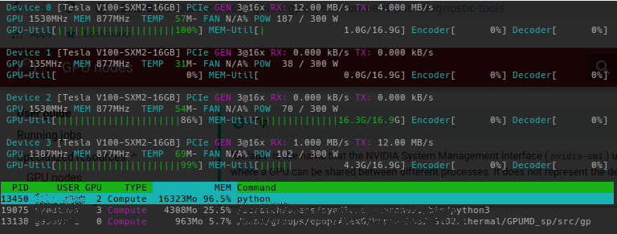

To support the latest computing evolutions in many fields of science, Sherlock
provides GPU nodes that can be used to run a variety of GPU-accelerated
applications. Those nodes are available to everyone, but are a scarce,
highly-demanded resource, so getting access to them may require some wait time
in queue.

!!! info "Getting your own GPU nodes"

    If you need frequent access to GPU nodes, we recommend considering
    [becoming an owner on Sherlock][url_condo], so you can have immediate
    access to your GPU nodes when you need them.


## GPU nodes

A limited number of GPU nodes are available in the `gpu` partition. Anybody
running on Sherlock can submit a job there. As owners contribute to expand
Sherlock, more GPU nodes are added to the `owners` partition, for use by PI
groups which purchased their own compute nodes.

!!! tip "More GPU types to come"

    As we merge cluster nodes during Phase 2, the existing Sherlock 1.0 GPU
    nodes will be added to the `gpu` partition on Sherlock 2.0

There currently are two types of GPUs available in the `gpu` partition:

* NVIDIA Tesla P100-PCIe[^p100], for applications requiring double-precision
  (64-bit) and deep-learning training workloads,
* NVIDIA Tesla P40[^p40], for single- or half-precision (32, 16-bit) workloads
  and deep-learning inference jobs.


## Submitting a GPU job

To submit a GPU job, you'll need to use the `--gres` option in your batch script
or command line submission options.

For instance, the following script will request one GPU for two hours in the
`gpu` partition, and run the GPU-enabled version of `gromacs`:

```bash
#!/bin/bash
#SBATCH -p gpu
#SBATCH -c 10
#SBATCH --gres gpu:1

ml load gromacs/2016.3

srun gmx_gpu ...
```

You can also directly run GPU processes on compute nodes with `srun`. For
instance, the following command will display details about the GPUs allocated
to your job:

```
$ srun -p gpu --gres gpu:2 nvidia-smi
Fri Jul 28 12:41:49 2017
+-----------------------------------------------------------------------------+
| NVIDIA-SMI 375.51                 Driver Version: 375.51                    |
|-------------------------------+----------------------+----------------------+
| GPU  Name        Persistence-M| Bus-Id        Disp.A | Volatile Uncorr. ECC |
| Fan  Temp  Perf  Pwr:Usage/Cap|         Memory-Usage | GPU-Util  Compute M. |
|===============================+======================+======================|
|   0  Tesla P40           On   | 0000:03:00.0     Off |                    0 |
| N/A   26C    P8    10W / 250W |      0MiB / 22912MiB |      0%   E. Process |
+-------------------------------+----------------------+----------------------+
|   1  Tesla P40           On   | 0000:04:00.0     Off |                    0 |
| N/A   24C    P8    10W / 250W |      0MiB / 22912MiB |      0%   E. Process |
+-------------------------------+----------------------+----------------------+

+-----------------------------------------------------------------------------+
| Processes:                                                       GPU Memory |
|  GPU       PID  Type  Process name                               Usage      |
|=============================================================================|
|  No running processes found                                                 |
+-----------------------------------------------------------------------------+
```

!!! warning "GPU resources MUST be requested explicitly"

    Jobs will be rejected at submission time if they don't explictly request
    GPU resources.


The `gpu` partition only accepts jobs explicitly requesting GPU resources. If
they don't, they will be rejected with the following message:

```
$ srun -p gpu --pty bash
srun: error: Unable to allocate resources: Job violates accounting/QOS policy (job submit limit, user's size and/or time limits)
```


### GPU types

Since Sherlock features many different types of GPUs, each with its own
technical characteristics, performance profiles and specificities, you may want
to ensure that your job runs on a specific type of GPU.

To that end, Slurm allows users to specify *constraints* when submitting jobs,
which will indicate the scheduler that only nodes having features matching the
job constraints could be used to satisfy the request. Multiple constraints may
be specified and combined with various operators (please refer to the official
[Slurm documentation][url_slurm_sbatch] for details).

The list of available features on GPU nodes can be obtained with the
`node_feat`[^node_feat] command:

```
$ node_feat -p gpu | grep GPU_
GPU_BRD:TESLA
GPU_GEN:PSC
GPU_MEM:16GB
GPU_MEM:24GB
GPU_SKU:TESLA_P100_PCIE
GPU_SKU:TESLA_P40
```

`node_feat` will only list the features of nodes from partitions you have
access to, so output may vary depending on your group membership.

The different characteristics[^values] of various GPU types are listed in the following
table

| Slurm\ feature | Description | Possible values | Example job constraint |
| -------------- | ----------- | --------------- | ---------------------- |
| `GPU_BRD`      | GPU brand | `GEFORCE`: GeForce / TITAN<br>`TESLA`: Tesla | `#SBATCH -C GPU_BRD:TESLA` |
| `GPU_GEN`      | GPU generation | `PSC`: Pascal<br>`MXW`: Maxwell | `#SBATCH -C GPU_GEN:PSC` |
| `GPU_MEM`      | Amount of GPU memory | `16GB`, `24GB` | `#SBATCH -C GPU_MEM:16GB` |
| `GPU_SKU`      | GPU model | `TESLA_P100_PCIE`<br/>`TESLA_P40` | `#SBATCH -C GPU_SKU:TESLA_P40` |

Depending on the partitions you have access to, more features may be available
to be requested in your jobs.


For instance, to request a Tesla GPU for you job, you can use the following
submisison options:

```
$ srun -p owners --gres gpu:1 -C GPU_BRD:TESLA nvidia-smi -L
GPU 0: Tesla P100-SXM2-16GB (UUID: GPU-4f91f58f-f3ea-d414-d4ce-faf587c5c4d4)
```

!!! warning "Unsatisfiable contraints"

    If you specify a constraint that can't be satisfied in the partition you're
    submitting your job to, the job will be rejected by the scheduler.     For
    instance, requesting a GeForce GPU in the `gpu` partition, which only
    features Tesla GPUs, will result in an error:

    ```
    $ srun -p gpu --gres gpu:1 -C GPU_BRD:GEFORCE nvidia-smi -L
    srun: error: Unable to allocate resources: Requested node configuration is not available
    ```


### GPU compute modes

By default, GPUs on Sherlock are set in the **Exclusive Process** compute
mode[^gpu_cmodes], to provide the best performance and an isolated environment
for jobs, out of the box.

Some software may require GPUs to be set to a different compute mode, for
instance to share a GPU across different processes within the same application.

To handle that case, we developed a specific option, `--gpu_cmode`, that users
can add to their `srun` and `sbatch` submission options, to choose the compute
mode for the GPUs allocated to their job.

Here's the list of the different compute modes supported on Sherlock's GPUs:

| GPU\ compute\ mode   | `--gpu_cmode` option | Description |
| -------------------- | -------------------- | ----------- |
| "Default"            | `shared`             | Multiple contexts are allowed per device (NVIDIA default) |
| "Exclusive Process"  | **`exclusive`**      | Only one context is allowed per device, usable from multiple threads at a time (Sherlock default)|
| "Prohibited"         | `prohibited`         | No CUDA context can be created on the device |

By default, or if the `--gpu_cmode` option is not specified, GPUs will be set
in the "Exclusive Process" mode, as demonstrated by this example command:

```
$ srun -p gpu --gres gpu:1 nvidia-smi
+-----------------------------------------------------------------------------+
| NVIDIA-SMI 387.26                 Driver Version: 387.26                    |
|-------------------------------+----------------------+----------------------+
| GPU  Name        Persistence-M| Bus-Id        Disp.A | Volatile Uncorr. ECC |
| Fan  Temp  Perf  Pwr:Usage/Cap|         Memory-Usage | GPU-Util  Compute M. |
|===============================+======================+======================|
|   0  Tesla P40           On   | 00000000:03:00.0 Off |                    0 |
| N/A   22C    P8    10W / 250W |      0MiB / 22912MiB |      0%   E. Process |
+-------------------------------+----------------------+----------------------+
```

With the `--gpu_cmode` option, the scheduler will set the GPU compute mode to
the desired value before execution:

```
$ srun -p gpu --gres gpu:1 --gpu_cmode=shared nvidia-smi
+-----------------------------------------------------------------------------+
| NVIDIA-SMI 387.26                 Driver Version: 387.26                    |
|-------------------------------+----------------------+----------------------+
| GPU  Name        Persistence-M| Bus-Id        Disp.A | Volatile Uncorr. ECC |
| Fan  Temp  Perf  Pwr:Usage/Cap|         Memory-Usage | GPU-Util  Compute M. |
|===============================+======================+======================|
|   0  Tesla P40           On   | 00000000:03:00.0 Off |                    0 |
| N/A   22C    P8    10W / 250W |      0MiB / 22912MiB |      0%      Default |
+-------------------------------+----------------------+----------------------+
```

!!! Tip

    "Default" is the name that the NVIDIA System Management Interface
    (`nvidia-smi`) uses to describe the mode where a GPU can be shared between
    different processes. It does not represent the default GPU compute mode on
    Sherlock, which is "Exclusive Process".


## Environment and diagnostic tools

--8<--- "_wip.md"


### `nvtop`

GPU usage information can be shown with the [`nvtop`][url_nvtop] tool. `nvtop`
is available as a [module][url_modules], which can be loaded like this:

```
$ ml load system nvtop
```


`nvtop` provides an [`htop`][url_htop]-like interactive view of GPU
utilization.  Users can monitor, estimate and fine tune their GPU resource
requests with this tool.  Percent GPU and memory utilization is shown as a
user's GPU code is running.




[comment]: #  ( modules (g) cuda nvcc, nvidia-smi,  CUDA_VISIBLE_DEVICES)

[comment]: #  ( ## Multi-GPU topologies, ## GPU mode )

[comment]: #  (link URLs -----------------------------------------------------)

[url_condo]:        /docs/overview/concepts/#the-condominium-model
[url_modules]:      /docs/software/modules
[url_p100]:         //images.nvidia.com/content/tesla/pdf/nvidia-tesla-p100-PCIe-datasheet.pdf
[url_p40]:          //images.nvidia.com/content/pdf/tesla/184427-Tesla-P40-Datasheet-NV-Final-Letter-Web.pdf
[url_slurm_sbatch]: //slurm.schedmd.com/sbatch.html#OPT_constraint
[url_gpu_cmodes]:   http://docs.nvidia.com/cuda/cuda-c-programming-guide/index.html#compute-modes
[url_nvtop]:        https://github.com/Syllo/nvtop
[url_htop]:         https://hisham.hm/htop/


[comment]: #  (footnotes -----------------------------------------------------)

[^p100]: See the complete [Tesla P100 technical specifications][url_p100] for
  details.
[^p40]: See the complete [Tesla P40 technical specifications][url_p40] for
  details.
[^node_feat]: See `node_feat -h` for more details.
[^values]: The lists of values provided in the table are non exhaustive.
[^gpu_cmodes]: The list of available GPU compute modes and relevant details are
  available in the [CUDA Toolkit Documentation][url_gpu_cmodes]
