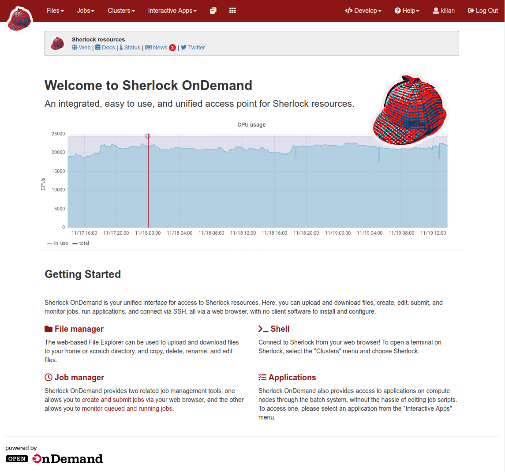
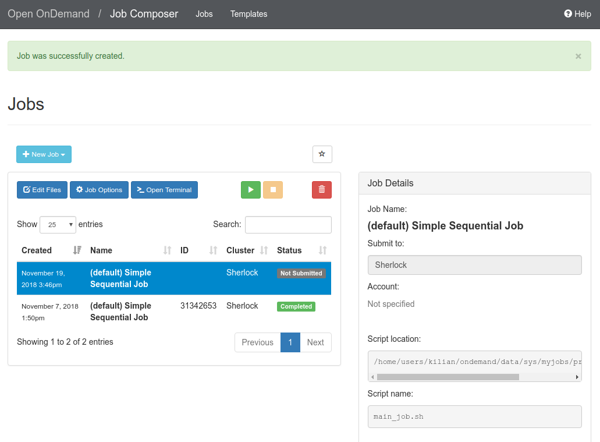
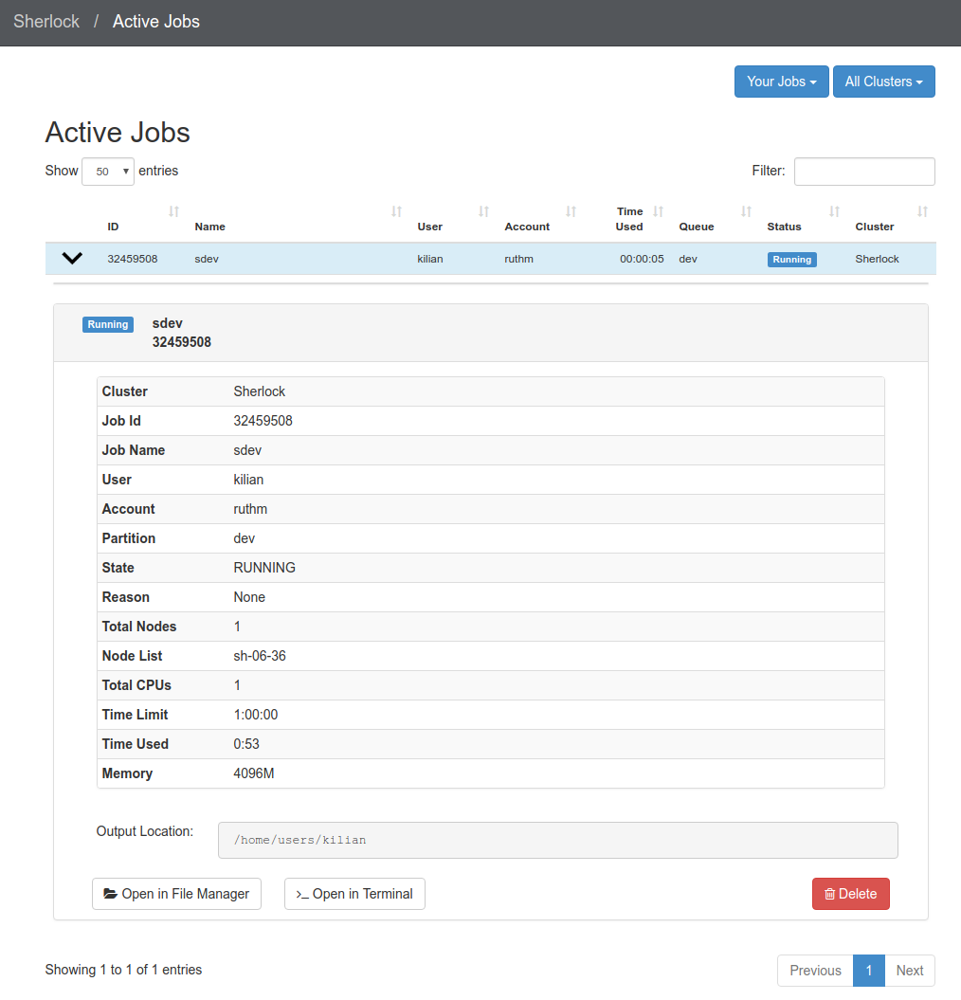
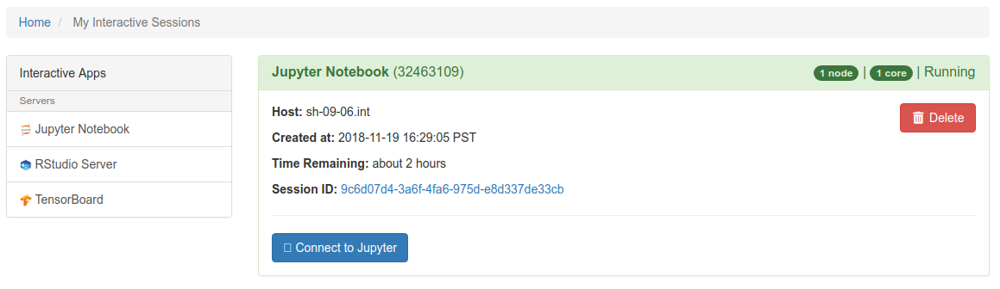

## Introduction

The Sherlock OnDemand interface allows you to conduct your research on Sherlock
through a web browser. You can manage files (create, edit and move them),
submit and monitor your jobs, see their output, check the status of the job
queue, run a Jupyter notebook and much more, without logging in to Sherlock the
traditional way, via a SSH terminal connection.

### More documentation
<div style="float:right">
[][url_ood]
</div>
[Open OnDemand][url_ood] was created by the [Ohio Supercomputer
Center][url_osc].


The following documentation is specifically intended for using OnDemand on
Sherlock. For more complete documentation about OnDemand in general, please see
the [extensive documentation for OnDemand created by OSC][url_ood_docs],
including many video tutorials.


## Connecting

!!! Note "Connection information"

    To connect to Sherlock OnDemand, simply point your browser to
    **https://login.sherlock.stanford.edu**

Sherlock OnDemand requires the same level of authentication than connecting to
Sherlock over SSH. You will be prompted for your SUNet ID and password, and
will go through the regular two-step authentication process.

The Sherlock OnDemand **Dashboard** will then open. From there, you can use the
menus across the top of the page to manage files, get a shell on Sherlock,
submit jobs or open interactive applications such as Jupyter Notebooks or
RStudio sessions.



To end your Sherlock OnDemand session, click on the ["Log Out"](url_ood_logout)
link at the top right of the Dashboard window and close your browser.


## Getting a shell

You can get shell access to Sherlock by choosing **Clusters > Sherlock Shell
Access** from the top menu in the OnDemand **Dashboard**.

In the window that will open, you'll be logged in to one of Sherlock' login
nodes, exactly as if you were using SSH to connect. Except you don't need to
install any SSH client on your local machine, configure [Kerberos][url_gssapi]
or deal with your SSH client configuration to [avoid endless two-factor
prompts][url_avoid_duo]. How cool is that?


## Managing files

To create, edit or move files, click on the **Files** menu from the
**Dashboard** page. A dropdown menu will appear, listing your most common
[storage locations][url_storage] on Sherlock: `$HOME`, `$GROUP_HOME`,
`$SCRATCH`. `$GROUP_SCRATCH` and `$OAK`[^oak_access].

Choosing one of the file spaces opens the **File Explorer** in a new browser
tab. The files in the selected directory are listed.

!!! note "Left panel will always display `$HOME`"

    No matter which directory you are in, your home directory is displayed in a
    panel on the left.

There are two sets of buttons in the File Explorer.

* On the top left, just below the name of the current directory:
  
  Those buttons allow you to
  **View**, **Edit**, **Rename**, **Download**, **Copy**, **Paste** (after you
  have moved to a different directory) or **Delete** a file, or you can toggle
  the file selection with **(Un)Select All**.

* At the top of the window, on the right side:
  

    | Button | Function |
    | ------ | -------- |
    | **Go To** | Navigate to another directory or file system |
    | **Open in Terminal** | Open a terminal window on Sherlock in a new browser tab |
    | **New File** | Create a new, empty file |
    | **New Dir** | Create a new subdirectory |
    | **Upload** | Copy a file from your local machine to Sherlock |
    | **Show Dotfiles** | Toggle the display of dotfiles (files starting by a `.`, which are usually hidden) |
    | **Show Owner/Mode** | Toggle the display of owner and permisson settings |


## Creating and editing jobs

You can create new job scripts, edit existing scripts, and submit them to the
scheduler throught the Sherlock OnDemand interface.

From the top menus in the **Dashboard**, choose **Jobs > Job Composer**. A Job
Composer window will open. There are two tabs at the top: **Jobs** and
**Templates**.

In the **Jobs** tab, you'll find a list of the job you've submitted through
OnDemand. The **Templates** tab will allow you to define your own job
templates.

### Creating a new job script

To create a new job script. you'll need to follow the steps below.

#### Select a template

Go to the **Jobs** tab in the **Jobs Composer** interface. You'll find a
default template there: "_Simple Sequential Job_".

To create a new job script, click the blue **New Job > From Default Template**
button in the upper left. You'll see a green message at the top of the
page indicating: "Job was successfully created".

At the right of the **Jobs** page, you can see the **Job Details**, including
the location of the script and the script name (by default, `main_job.sh`).
Under that, you will see the contents of the job script in a section named
**Submit Script**.



#### Edit the job script

You'll need to edit the job script, so it contains the commands and workflow
that you want to submit to the scheduler.

If you need more resources than the defaults, you must include options to
change them in the job script. For more details, see the [Running
jobs](url_running_jobs) section.

You can edit the script in several ways:
* click the blue **Edit Files** button at the top of the **Jobs** tab in the
  Jobs Composer window,
* in the **Jobs** tab in the **Jobs Composer** window, find the **Submit
  Script** section at the bottom right. Click the blue **Open Editor** button.

After you save the file, the editor window remains open, but if you return to
the **Jobs Composer** window, you will see that the content of  your script has
changed.

#### Edit the job options

In the **Jobs** tab in the **Jobs Composer** window, click the blue **Job
Options** button. The options for the selected job such as name, the job script
to run, and the account it run under are displayed and can be edited. Click
**Save** or **Cancel** to return to the job listing.


## Submitting jobs

To submit a job, select in in the **Jobs** tab in the **Jobs Composer** page.
Click the green **Submit** button to submit the selected job. A message at the
top of the window shows whether the job submission was successful or not. If it
is not, you can edit the job script or options and resubmit. When the job is
submitted successfully, the status of the job in the **Jobs Composer** window
will change to _Queued_ or _Running_. When  the job completes, the status will
change to _Completed_.


## Monitoring jobs

From the **Dashboard** page, The **Jobs > Active Jobs** top-level menu will
bring you to a live view of Sherlock's scheduler queue. You'll be able to see
all the jobs currently in queue, including running and pending jobs, as well as
eome details about individual jobs.



At the bottom of the detailled view, you'll find two button that will bring you
to the directory where that job's files are located, either in the **File
Manager** or in a **Shell** session.


## Interactive applications

One of the main features of Sherlock OnDemand is the ability to run
interactive applications difrectly from the web interface, without leaving your
web browser.


### Jupyter Notebooks

You can run Jupyter Notebooks (using Python, Julia or other languages) through
Sherlock OnDemand.

!!! warning "Some preliminary setup may be required"

    Before running your first Jupyter Notebook with `IJulia`, you'll need to
    run the following steps (this only need to be done once):

    ```
    $ ml julia
    $ julia
    julia> using Pkg;
    julia> Pkg.add("IJulia")
    ```

    When you see the message that `IJulia` has been installed, you can end your
    interactive session.

To start a Jupyter session from Sherlock OnDemand:

1. Select **Interactive Apps > Jupyter Notebook** from the top menu in the
   **Dashboard** page,

2. In the screen that opens, specify the different parameters for your job
   (time limit, number of nodes, CPUs, partition to use, etc.). You can also
   choose to be notified by email when your notebook start.

   

3. Click the blue **Launch** button to start your JupyterHub session. You may
   have to wait in the queue for resources to become available for you.

4. When your session starts, you can click on the blue **Connect to Jupyter**
   button to open your Jupyter Notebook. The Dashboard window will display
   information about your Jupyter session, including the name of the compute
   node it is running on, when it started, and how much time remains.
   

5. In your new Jupyter Notebook tab, you'll see 3 tabs: Files, Running and
   Clusters.
   

   By default, you are in the **Files** tab, that displays the contents of your
   `$HOME` directory on Sherlock. You can navigate through your files there.

   Under the **Running** tab, you will see the list of all the notebooks or
   terminal sessions that you have currently running.

6. You can now start a Jupyter Notebook:

    1. To open an exiting Jupyter Notebook, which is already stored on
       Sherlock, navigate to its location in the **Files** tab and click on its
       name. A new window running the notebook will open.
    2. To create a new Jupyter Notebook, click on the **New** button at the top
       right of the file listing, and choose the kernel of your choice from the
       drop down.

To terminate your Jupyter Notebook session, go back to the Dashboard, and click
on the **My Interactive Sessions** in the top menu. This will bring you to a
page listing all your currently active interactive session. Identify the one
you'd like to terminate and click on the red **Delete** button.


### RStudio

To run RStudio via Sherlock OnDemand:

1. Select **Interactive Apps > RStudio Server** from the top menu in the
   Dashboard page,

2. In the screen that opens, specify the different parameters for your job
   (time limit, number of nodes, CPUs, partition to use, etc.). You can also
   choose to be notified by email when your notebook start.

3. Click the blue **Launch** button to start your RStudio session. You may have
   to wait in the queue for resources to become available.

4. When your session starts, click the blue **Connect to RStudio Server**
   button. A new window opens with the RStudio interface.


### Tensorboard

To run Tensorboard via Sherlock OnDemand:

1. Select **Interactive Apps > Tensorboard** from the top menu in the
   Dashboard page,

2. In the screen that opens, specify the different parameters for your job
   (time limit, number of nodes, CPUs, partition to use, etc.). You can also
   choose to be notified by email when your notebook start.

3. Click the blue **Launch** button to start your Tensorboard session. You may have
   to wait in the queue for resources to become available.

4. When your session starts, click the blue **Connect to Tensorboard**
   button. A new window opens with the Tensorboard interface.


[comment]: #  (link URLs -----------------------------------------------------)

[url_oak]:          https://oak-storage.stanford.edu
[url_osc]:          https://www.osc.edu
[url_ood]:          https://openondemand.org
[url_ood_docs]:     https://www.osc.edu/resources/online_portals/ondemand

[url_ood_logout]:   https://login.sherlock.stanford.edu/logout

[url_storage]:      /docs/storage
[url_gssapi]:       /docs/advanced-topics/connection/#gssapi
[url_avoid_duo]:    /docs/advanced-topics/connection/#avoiding-multiple-duo-prompts
[url_running_jobs]: /docs/user-guide/running-jobs/

[comment]: #  (footnotes -----------------------------------------------------)

[^oak_access]:      if you have access to the [Oak storage system][url_oak].

